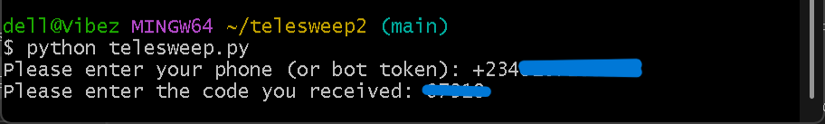
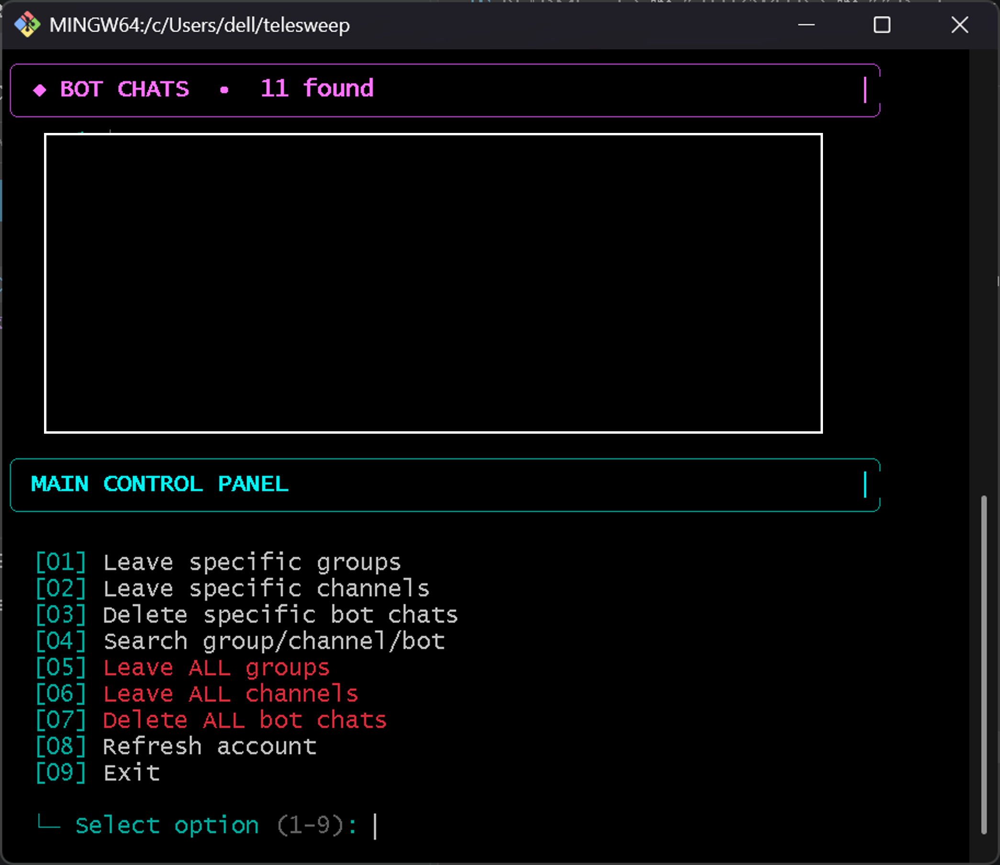

# TELESWEEP

### Telegram Account Cleanup & Organization Tool

TELESWEEP is a Python utility for managing and cleaning up Telegram groups, channels, and bot chats through the Telegram API.

## Features

* View groups, channels, and bot chats
* Leave selected groups or channels
* Delete selected bot chats
* Search groups, channels, and bots
* Select individual items or ranges
* Leave all groups
* Leave all channels
* Delete all bot chats
* Confirmation before destructive actions
* Flood wait handling
* Progress tracking

## Requirements

* Python 3.9+
* Telegram account
* Telegram API credentials

## Installation

```bash
git clone YOUR_REPOSITORY_URL
cd TELESWEEP
pip install -r requirements.txt
```

## Telegram API Credentials

TELESWEEP requires an `API ID` and `API Hash`.

1. Go to [my.telegram.org](https://my.telegram.org/)
2. Log in with your Telegram account.
3. Select **API development tools**.
4. Create an application.
5. Copy your `api_id` and `api_hash`.


## Configuration

Create a `.env` file in the project directory:

```env
TELEGRAM_API_ID=your_api_id
TELEGRAM_API_HASH=your_api_hash
```

`.env` is ignored by Git and should never be uploaded to GitHub.

## Run

```bash
python telesweep.py
```

On the first run, Telegram will ask you to authenticate.



After authentication, Telethon creates:

```text
telegram_session.session
```

The session file is stored locally so you do not have to authenticate every time.

Do not share or upload the session file.

## Usage

TELESWEEP displays your groups, channels, and bot chats separately.

```text
[01] Leave specific groups
[02] Leave specific channels
[03] Delete specific bot chats
[04] Search group/channel/bot
[05] Leave ALL groups
[06] Leave ALL channels
[07] Delete ALL bot chats
[08] Refresh account
[09] Exit
```



### Selection

Single item:

```text
2
```

Multiple items:

```text
2,5,8
```

Range:

```text
2-19
```

Multiple ranges:

```text
2-19, 21-28, 30-87
```

TELESWEEP requires `LEAVE` confirmation before performing destructive actions.

## Project Structure

```text
TELESWEEP/
├── telesweep.py
├── requirements.txt
├── .env.example
├── .gitignore
├── README.md
└── images/
    ├── api-credentials.png
    ├── first-run.png
    └── main-menu.png
```

## Security

Never commit or share:

```text
.env
*.session
*.session-journal
```

Your `.env` contains your Telegram API credentials. Your session file contains your authenticated Telegram session.

## Disclaimer

TELESWEEP is intended for personal Telegram account management and organization. Use it responsibly and in accordance with Telegram's terms and policies.

---

**TELESWEEP**
Telegram Account Cleanup & Organization Tool

Made by Paul
Telegram: @vibezat1k
